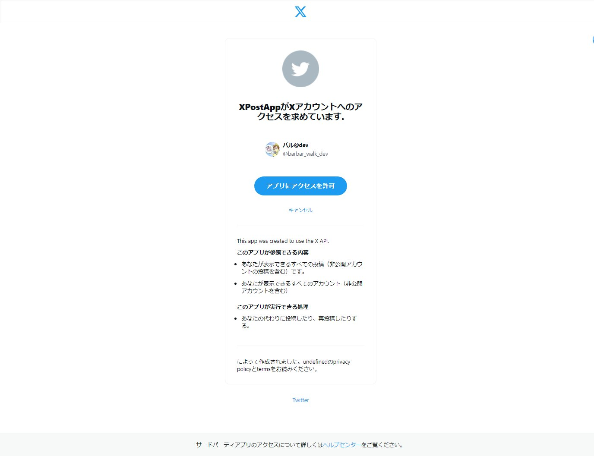

# XPost

X（旧：Twitter）のSNS連携のサンプルコードです。 
2024/05/02現在、Freeの開発アカウントで利用できるAPIを試したものになります。

- OAuth認証
- 自身の情報取得（GET /2/users/me）
- 投稿（POST /2/tweets）
- 投稿削除（DELETE /2/tweets/:id）

言語はJava、アーキテクチャはSpringBoot3.0.4使ってます。 
詳細はbuild.gradleを御覧ください。

画面のデザインは[Nice Admin](https://bootstrapmade.com/nice-admin-bootstrap-admin-html-template/)を利用させてもらいました。

## 画面説明

簡単な画面説明です。

### ログイン画面

ログイン画面です。

「ログイン！！」ボタンタップで、XのOAuth認証画面へ遷移します。

XのOAuth認証画面です。 
※簡易的な実装なので、認証後アクセストークンはセッションに保持しています。URL直打ちなどで、ログインページを表示すればセッション情報は破棄されます。

### 投稿画面

投稿画面です。 
投稿内容はアプリ内のDBに保存されるとともに、Xに投稿します。 
また、投稿した内容は削除することができます。 
削除機能は、Xに投稿した内容を削除し、DBに保存した内容も削除します。

初期表示時。投稿が無い状態です。

投稿がある状態です。 
「削除」ボタン押下で、該当の投稿が削除されます。

Xに投稿された内容です。 
※テキストのみ投稿可能です。リンクや画像などの投稿は対応できていません。

## ライセンス

このプロジェクトはMITライセンスのもとでライセンスされています。詳細については、LICENSE.txtファイルを参照してください。
